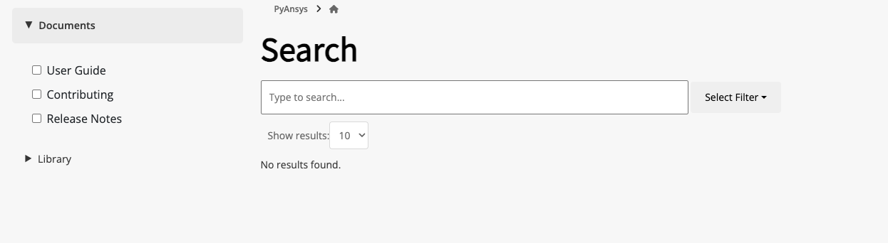

.. _ref_user_guide_html_theme:

HTML theme options
==================

In the Sphinx configuration (``conf.py``) file in the ``doc`` directory, you can use the
``html_theme_options`` dictionary to customize the Ansys Sphinx theme.

Show breadcrumbs
----------------

Showing breadcrumbs at the top of your documentation pages makes navigation easier.
Breadcrumbs are shown by setting ``"show_breadcrumbs": True``. To add additional
*root* breadcrumbs, ``"additional_breadcrumbs"`` is set to a list of tuples in
this form: ``("Link text", "url")``.

This ``html_theme_options`` dictionary show breadcrumbs, including a root breadcrumb
for the documentation landing page for the Ansys repository:

.. code:: python

   html_theme_options = {
       "github_url": "https://github.com/ansys/ansys-sphinx-theme",
       "show_prev_next": True,
       "show_breadcrumbs": True,
       "additional_breadcrumbs": [
           ("PyAnsys", "https://docs.pyansys.com/"),
       ],
   }

When you are on the landing page for your documentation, the breadcrumb shows the title for this
page. However, Sphinx cannot access this title from other documentation pages. Thus, after
``html_theme_options`` dictionary, you must set ``html_short_title`` to the display text to
use for this breadcrumb.

To ensure a consistent user experience, always set the ``html_short_title``
(or optionally ``html_title`` if ``html_short_title`` is not used) to the library name.

For example, in the ``conf.py`` file for the Ansys Sphinx Theme, this line is added
after the ``html_theme_options`` dictionary:

.. code:: python

   html_short_title = html_title = "Ansys Sphinx Theme"

If you want the title for your documentation's main ``index.rst`` file to show the version,
include ``|version|`` in the title:

.. code:: python

   html_short_title = html_title = "Ansys Sphinx Theme |version|"

Add and hide icons in the navigation bar
----------------------------------------

The navigation bar shows two icons on the right by default. The first is for
switching between light and dark modes. The second is for going to the library's
GitHub repository.

- For comprehensive information on adding custom link behavior, see
  `Add custom attributes to icon links <https://pydata-sphinx-theme.readthedocs.io/en/stable/user_guide/header-links.html#add-custom-attributes-to-icon-links>`_
  in the PyData Theme documentation.
- For comprehensive information on how to use Font Awesome to add icons, see `How To Add Icons <https://fontawesome.com/v6/docs/web/add-icons/how-to>`_
  in the Font Awesome documentation.

The following sections explain how to add icons and hide icons.

Add icons
~~~~~~~~~

In the ``conf.py`` file, the ``html_theme_options`` dictionary has a child ``icon_links``
dictionary. To add icons to the navigation bar, add them to the ``icon_links``
dictionary. For each icon to add, specify its ``name``, the associated ``url``,
the ``icon``, and the ``type``.

This example adds an icon for sending an email:

.. code-block:: pycon

    html_theme_options = {
     "icon_links": [
         dict(name="Mail", url="mailto:me", icon="fas fa-envelope")
     ],
     ...
    }

Hide icons
~~~~~~~~~~

To hide icons so that they do not show in the navigation bar, add their names
to the ``hidden_icons`` dictionary:

.. code-block:: pycon

    html_theme_options = {
        "hidden_icons": ["GitHub"],
        ...
    }

If you want to hide all icons, use the ``show_icons`` Boolean variable:

.. code-block:: pycon

    html_theme_options = {
        "show_icons": False,
        ...
    }

Static search options
----------------------

The Ansys Sphinx theme supports static search options to customize the search
experience.

The static search bar is created using ``Fuse.js``. You can provide `all
options <https://www.fusejs.io/api/options.html>`_ supported by ``Fuse.js``
through the ``static_search`` dictionary in the ``html_theme_options``.

To improve the search performance, a debounce function is available. By
default, a delay of 300 milliseconds is applied. To modify this value, declare
the ``delay`` key in the ``static_search`` dictionary with a value specifying
the amount of milliseconds to wait before executing the search. A value of
``0`` disables the debounce function.

Additionally, you can decide the limit of the search results by setting the
``limit`` key in the ``static_search`` dictionary. The default value is ``10``.

To exclude files or directories from the search index, you can use the
``files_to_exclude`` key in the ``static_search`` dictionary. This key is a list
of strings representing the directories or files to exclude from the search
index.

Here is an example of how to add the ``static_search`` dictionary to the
``html_theme_options`` dictionary:

.. code-block:: python

    html_theme_options = {
        "static_search": {
            "threshold": 0.5,
            "limit": 10,
            "minMatchCharLength": 1,
            "delay": 300,
            "files_to_exclude": ["_build", "api/", "examples/sphinx_demo"],
        },
    }

.. note::

    All other options are available in the `Fuse.js documentation <https://fusejs.io/api/options.html>`_.

Here is an example of how to add the ``static_search`` dictionary to the
``html_theme_options`` dictionary:

.. code-block:: python

    html_theme_options = {
        "static_search": {
            "threshold": 0.5,
            "limit": 10,
            "minMatchCharLength": 1,
            "delay": 300,
        },
    }

.. note::

    Serve locally your documentation using the ``python -m http.server -d
    /path/to/docs/html/`` to have a live-preview of your search results. This
    method is compliant with the `CORS policy
    <https://developer.mozilla.org/en-US/docs/Web/HTTP/CORS>`_ and allows to
    load the generated resource files containing the indices of your
    documentation. The search bar does not work if you open the HTML files
    directly in the browser.

    To open the documentation in a local server, run the following command in
    the directory where the HTML files are located:

    .. code-block:: bash

        python -m http.server

    Then, open the browser and go to ``http://localhost:8000``.

Advanced search options
~~~~~~~~~~~~~~~~~~~~~~~

The Ansys Sphinx theme supports advanced search capabilities to enhance the user experience.

These options can be configured through the ``html_theme_options`` dictionary in your ``conf.py`` file.

Multi-index search
^^^^^^^^^^^^^^^^^^

To enable search across multiple documentation sources, use the ``search_extra_sources`` key.
This key should be a dictionary where each key is the name of the source and the value is the URL to that source.

**Example:**

.. code-block:: python

    html_theme_options = {
        "search_extra_sources":
        {
            "PyMAPDL": "https://mapdl.docs.pyansys.com/version/stable/",
            "PyAnsys": "https://docs.pyansys.com/version/stable/",
        }

Search filters
^^^^^^^^^^^^^^

To organize and group search results, you can define custom filters using the ``search_filters`` key.
This key should be a dictionary where each key represents a filter label and the corresponding value is a list of directories or file paths that belong to that filter.

**Example:**

.. code-block:: python

    html_theme_options = {
        "search_filters": {
            "User Guide": [
                "user-guide/",
                "getting-started/",
                "index/",
            ],
            "Release Notes": ["changelog"],
            "Examples": ["examples/"],
            "Contributing": ["contribute/"],
        },
    }

The filters appears as clickable options in the search interface, allowing users to refine their results by content type.

The search filters are displayed as below:

Cheat sheets
------------

If a cheat sheet has been created for your PyAnsys library, with ``quarto``, you can
add it to the left navigation pane of your documentation.

In the ``html_theme_options`` dictionary, you add a child dictionary named ``cheatsheet``
that contain these keys, in the order given:

#. ``file``: File name including the extension of the cheat sheet. If the file is inside a directory,
   include the directory name relative to the root of the documentation. For example, if the cheat sheet
   is in the ``getting_started`` directory, the file name is ``getting_started/cheat_sheet.qmd``.
#. ``title``: Title of the cheat sheet to be displayed in the left navigation pane.
#. ``pages``: List of names for the pages to include the cheat sheet on. If no value is provided,
   the cheat sheet is displayed only on the main ``index.html`` file.
#. ``version``: Version of the cheat sheet. If no value is provided, the version is ``main`` by default.

Here is an example of how to add the ``cheatsheet`` dictionary to the `html_theme_options`` dictionary:

.. code-block:: python

    html_theme_options = (
        {
            "cheatsheet": {
                "file": "<file name including the extension of the cheat sheet>",
                "title": "<title of the cheat sheet>",
                "version": "<version of the cheat sheet>",
                "pages": "<list of names for the pages to include the cheat sheet on>",  # Optional
            },
        },
    )

Here is an example of how to show a thumbnail of a PyMAPDL cheat sheet in the left navigation pane of its
main ``index.rst`` file and the ``learning.rst`` file in its "Getting started" section:

.. code-block:: python

    html_theme_options = (
        {
            "cheatsheet": {
                "file": "getting_started/cheat_sheet.qmd",
                "title": "My awesome cheat sheet",
                "version": f"{version}",
                "pages": ["index", "getting_started/learning"],
            },
        },
    )

.. note::

    To use this feature, you must have the `quarto <https://quarto.org/>` package installed. To create thumbnails of generated PDF files,
    the theme is using `pdf2image`. So you should have the ``poppler`` package installed in your system.
    For more information, see the `pdf2image documentation <https://pypi.org/project/pdf2image/>`_.

What's new section
------------------

The "What's new" section is an option that allows you to highlight new features in your library
for each minor version within the changelog file.

To install the "What's new" dependencies from ansys-sphinx-theme, run the following command:

.. code-block:: bash

    pip install ansys-sphinx-theme[changelog]

To get started, create a YAML file named ``whatsnew.yml`` in the ``doc/changelog.d`` directory. The
YAML file should contain the following structure:

.. code-block:: yaml

    fragments:
    - title: Feature title
      version: 0.2.0  # The version the feature is introduced
      content: |
        Feature description in RST format.

    - title: Another feature title
      version: 0.1.2
      content: |
        Feature description in RST format.

The dropdown generation only supports the following RST formats in the "content" field:

- Bold: Use double asterisks to wrap the text.
- Italics: Use single asterisks to wrap the text.
- Code samples: Use single or double backticks to wrap the text.
- Links: Use the following format to include links:

  .. code-block:: rst

     `link text <https://www.example.com>`_

- Code blocks: Use the following format to include code blocks:

  .. code-block:: rst

        .. code:: python

           print("hello world")

If a format is used in the "content" field that does not fall into the categories above, it will not
be rendered correctly.

To enable the "What's new" sections and sidebar in the changelog file, add the following dictionary
to the ``html_theme_options`` dictionary:

.. code-block:: python

    html_theme_options = (
        {
            "whatsnew": {
                "whatsnew_file_path": "../changelog.d/whatsnew.yml",
                "changelog_file_path": "changelog.rst",
                "sidebar_pages": ["changelog"],
                "sidebar_no_of_headers": 3,  # Optional
                "sidebar_no_of_contents": 3,  # Optional
            },
        },
    )

The dictionary contains the following keys:

- ``whatsnew_file_path``: The path to the YAML file containing what's new content local to the
  ``doc/source`` directory. If not provided, the what's new section will not be generated.
- ``changelog_file_path``: The path to the changelog.rst file local to the ``doc/source``
  directory. If not provided, the what's new section will not be generated.
- ``sidebar_pages``: List of names for the pages to include the what's new sidebar on. If not
  provided, the what's new sidebar is not displayed.
- ``sidebar_no_of_headers``: Number of minor version sections to display in the what's new sidebar.
   By default, it displays three version sections in the sidebar.
- ``sidebar_no_of_contents``: Number of what's new content to display under each minor version in the
   what's new sidebar. If not provided, it displays all dropdowns by default.

The following images show a sample "What's new" section and sidebar in the changelog file:

.. tab-set::

    .. tab-item:: What's new section

        .. image:: ../_static/whatsnew_section.png
           :alt: What's new section

    .. tab-item:: What's new sidebar

        .. image:: ../_static/whatsnew_sidebar.png
           :alt: What's new sidebar

.. note::

    If you are using both the "whatsnew" and "cheatsheet" options, the "cheatsheet" option will be
    displayed first in the left navigation pane, followed by the "What's new" section to maintain
    sidebar consistency.

Navigation bar dropdown
------------------------
This theme supports dropdown navigation bars. The layout is declared using a YAML file contained at any level in the ``doc/source`` directory.
The file path is relative to the ``doc/source`` directory,and must be specified in the ``html_theme_options`` dictionary.

- ``navigation_yaml_file``: The path to the YAML file containing the navigation structure.

.. code:: python

    html_theme_options = {
        ...,
        "navigation_dropdown": {
            "layout_file": "navbar.yml", # Relative path to the YAML file
        },
    }

Each entry in the YAML file may include the following fields:

- **file.** The relative path to the documentation file, based on the doc/source directory.

- **title.** The text displayed for the link in the dropdown navigation menu.

- **sections.** A list of nested navigation items. Each section can specify its own file, title, and an optional caption to provide a brief description.

.. code:: yaml

    - file: api/index
      title: "API Reference"

    - file: examples
      title: "Examples"
      sections:

        - file: examples/sphinx-design.rst
          title: "Sphinx Design Examples"
          caption: Examples of using Sphinx design features

        - file: examples/nbsphinx
          title: "Nbsphinx Examples"
          caption: Examples of using Nbsphinx for Jupyter Notebooks

.. warning::

    You must declare the complete layout of the dropdown navigation bar in the YAML file. Sphinx does not resolve it automatically.